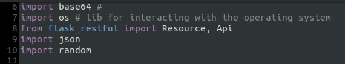
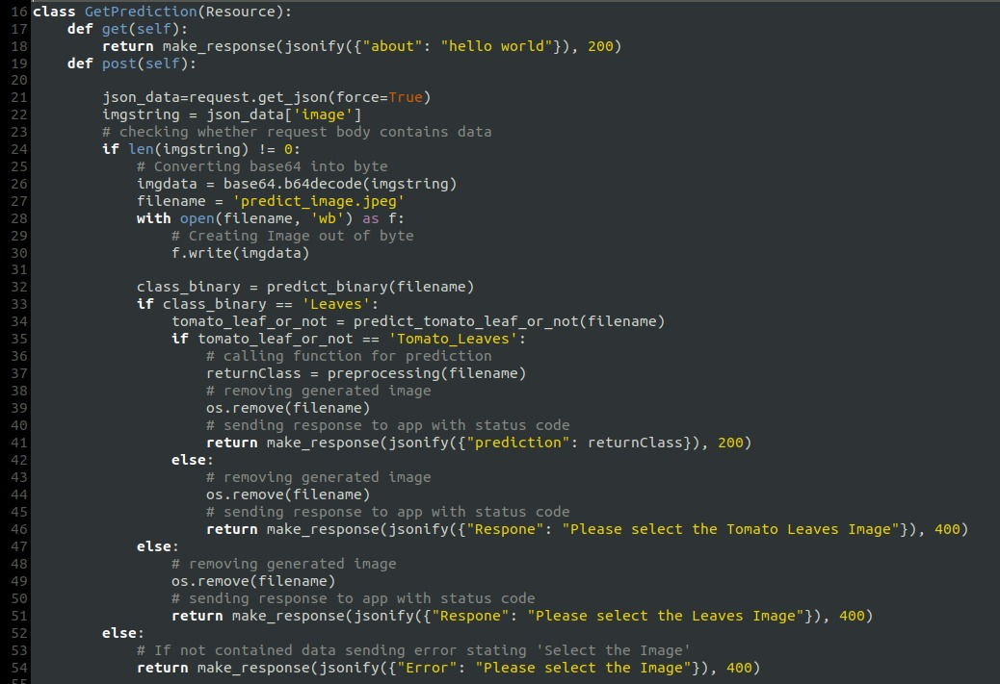
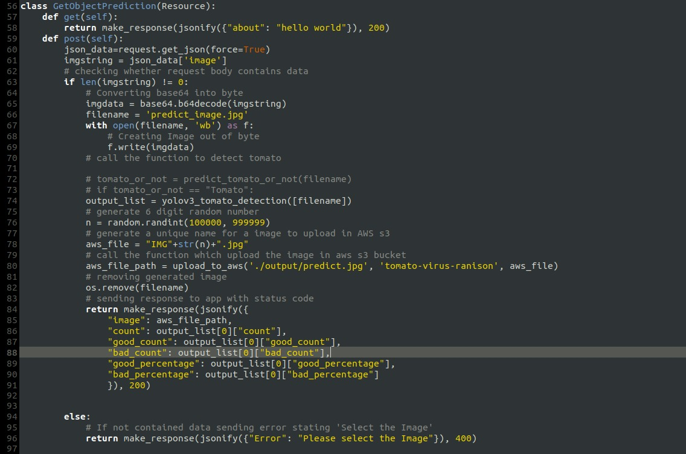

## Android application - VirusSafe Agro
### About virusSafe Agro:
Viruses in tomato plants cause humongous damages in Victoria, which results in massive losses. virusSafe Agro aims to inculcate awareness among farmers by providing an educational platform and ways to mitigate the risk of loss of their cultivation from viruses. 

### virusSafe Agro specifications:
virusSafe Agro is your one-stop shop for a smorgasbord of learning about viruses in tomato plants. It is designed specifically for farmers who are new to farming or who wish to take farming as a profession in near future. 

- [x] This resource gives farmers an option to check whether their tomato plants are infected or not by clicking and uploading a picture of their plant.
- [x] On uploading the picture, the user gets instant feedback on whether the plant is infected or not. 
- [x] The learnings involve content related to nine types of viral diseases in tomato plants.
- [ ] The application includes description, causes, chemical and non-chemical control strategies, as well as a quiz which helps the farmer to check their knowledge on tomato virus.
- [ ] Further update will include information related to nutrient deficiencies in tomato plants.

### What does *virusSafe Agro* application help you for?
virusSafe Agro helps in checking if the plant is infected or not and provides preventive measures such as chemical and non-chemical control strategies that can be taken to avoid the spread of virus. However, the farmers should not solely rely on virusSafe Agro recommendations and should take professional advice for further guidance. virusSafe Agro does not guarantee the completeness or accuracy of information.

## Mahara page link:  
Follow the link to check our Mahara e-portfolio:

[](https://mahara.infotech.monash.edu.au/mahara/view/view.php?id=49981)

***
## Installation:
Clone this repository and import into **Android Studio**
```bash
git clone https://github.com/hoyyang/virusSafe-Agro.git
```

## Generating signed APK:
From Android Studio:
1. **Build** menu
2. **Generate Signed APK...**
3. Fill in the keystore information *(you only need to do this once manually and then let Android Studio remember it)*

## Architecture
### System architecture:
The whole distributed system architecture for this Android App project is a **client-server architecture**.  The client endpoint, the App in an Android phone, holds all views and logic for handling data of displaying.  In this distributed system, there are several servers for holding persistent data and resources or calculating model.  And the client and servers deliver data by open API created by ourselves.  We build this application by using the following web services:
1. **Machine Learning Model** - deployed on AWS with EC2
2. **MySql Database** - deployed on AWS with RDS (APIs are built by Lambda function and API Gateway in AWS)
3. other **Web Service**

### Android application architecture
Within the client endpoint(Android App), there are different widgets for different pages and functions. For our project, there is **one activity**(current version) holding several **fragments**. One fragment holds one page.  And each fragment has a **ViewModel**, holding **live data**, mapping with it individually, which is for controlling the data interact with the remote server or other data storage tool. The interaction way for ViewModel and remote servers is **API**.

## Tools or Services Used
|Software or Service|Purpose|
|---|---|
|Android studio|Front end development|
|MySQLWorkBench|MySQL database manager|
|Postman|API testing|
|GitHub+GitKraken|Versioning|
|AWS services|RDS: Database server|
||EC2: Server instance|
||S3: Media file storage|
||API gateway + Lambda: API manager
|Google APIs|Maps SDK for Android: Embed map widget|
||Places API: Searching nearby places|
||Custom Search API: Find news and tweets|

## Technology
### Android Technology Description:
The Android application development tool we used is "Android Studio" with the "Gradle" tool.  We used "Java" language to control the logic of our app and to interact with the data, and "XML" is used to display the UI.  For Android technologies, we used both the official and custom layouts and widgets.  In the official part, we used almost all layouts for satisfying the requirements of different pages, including FrameLayout, LinearLayout, RelativeLayout, ConstraintLayout, MotionLayout, CoordinatorLayout, AppBarLayout, GridLayout, and so on.  Besides, we also built some custom layouts like a draggable RelativeLayout for showing some extra information.  We used almost all the existing widgets for different display requirements. And there are also some custom widgets like a ViewPager that cannot be swiped.  There are also many other technologies, like animation technologies we chose are for view transition.  To implement a custom camera function, we embedded and configured the "CameraX".  GoogleMap is our map widget tool.  To share data among activities and fragments, we used ViewModel with LiveData.  To get an image bitmap from an image URL, we selected "Picasso".  And for managing API request and response, "OkHttp" and "GSON" are the two technologies we used.  In addition, we achieved event control and life cycle control. 
### Image classification:
One of the functionalities of our application is to provide novice farmers with the capability to check the infection in tomato plants. For this purpose, we have built an image classification model using the following technology stack.
- Tensorflow
- Keras
- Used Convolutional Neural Network Architecture
- Flask Web Application Framework to create a flask application of model so that it can be deployed on AWS
- AWS EC2 for model deployment

##### Model building process: 
There are 3 key phases of Model building mentioned below:
1. The model is trained using **Keras** and **Tensorflow** deep learning framework and using **CNN architecture**.
2. **Flask** has been used to create Restful API which can be deployed on cloud.
3. Flask application is deployed on **AWS EC2**.

##### Model accuracy: 
Model is currently approximately **89% accurate**.

##### Dataset:
Model is trained on 10,000 images belonging to following **10 classes**:
- Tomato mosaic virus
- Target Spot
- Bacterial spot
- Tomato Yellow Leaf Curl Virus
- Late blight
- Leaf Mold
- Early blight
- Spider Mites two-spotted 
- Tomato healthy
- Septoria spot

## Setting up in Local Machine

#### Step-1 
Open a `terminal`, clone the `virusSafe-Agro` repository and go into the directory using the command `cd`.
```bash
git clone https://github.com/hoyyang/virusSafe-Agro.git

cd DeepLearning-Application
```

#### Step-2
Check `python-3` is installed then install `pip` manager for python-3 and install `virtual environment`.
```bash
#Checking python is installed
python3 --version 

#Installing pip manager
sudo apt install python3-pip

#Checking pip is installed for python3
pip3 --version

#Installing virtual environment
sudo pip3 install virtualenv
```

#### Step-3
Setting up `virtual environment`.
```bash
#Creating virtual environment
virtualenv -p python3 venv

#Activating the virtual environment venv
source venv/bin/activate
```

#### Step-4
Now we have to install all the dependencies using pip in our virtual environment from `requirements.txt`.
Check `requirements.txt` to know what are all the dependencies used.
```python
pip3 install -r requirements.txt
```

#### Step-5
Now we are going to run our application in our `localhost`
```bash
python application.py
```

#### Step-6
API's will be available on the following URL's for the TomatoVirusDetection and TomatoObjectDetection.
```bash
# TomatoVirusDetection 
http://0.0.0.0:5000/ 

# TomatoObjectDetection
http://0.0.0.0:5000/object/
```

## Explanation of application.py



We start by importing our required Python packages on **Lines 6-10**.

### Tomato Leaf Virus Detection



Class which is used for **Tomato Virus Detection**. 

**Lines 17-18** is a GET function is someone hitting the api with GET Method.

**Lines 19-54** is for POST function, **Lines 21-30** where it reads the image from the request body, checking whether the image is there or not, as a Edge case, and writing the the base64 string as an image that will be used for a model and if the image is not there in a body then run block **lines 52-54**.

**Lines 32-51** where the multiple models are called for main use-case as well as edge-case
**Line 32** called a model to check whether the given image is of leaves or not, **lines 33-41** if it is of leaf, and if it is not a leaf it will run block **lines 47-51**.
**Line 34** called a model to check whether the given image is a tomato leaf or not, **lines 35-41** it is a tomato leaf, and if it is not a tomato leaf the run block **lines 42-46**.
**Line 37** calls the main model to predict the types of virus on a leaf.

### Tomato Object Detection



Class which is used for **Tomato Object Detection**.

**Lines 17-18** is a GET function is someone hitting the api with GET Method.

**Lines 59-96** is for POST function, **Lines 60-69** where it reads the image from the request body, checking whether the image is there or not, as a Edge case and writing the the base64 string as an image that will be used for a model and if the image is not there in a body then run block **lines 94-96**.

**Line 74** calls the function which will return the image with marked bonding boxes around tomatoes as well whether each tomato is good or bad.
**Lines 76-82** Generate the random file name and call a function which will upload the final output on a AWS S3 bucket and make it publically accessible and return the link to access that image

**Lines 74- 91** Creating the final response body and returning the response whose body contains 6 informations:

- Image path
- Total no. of tomatoes 
- Total no of good tomatoes
- Total no. of bad tomatoes
- Percentage of good tomatoes
- Percentage of bad tomatoes

## Model Location 

You can find all the models which we have used in the project at the following location:

[Model Location](https://drive.google.com/drive/folders/1a3v4f75JlAYB5IB6yHZw8KuhhozoPc9M?usp=sharing)

## Android App Gradle Dependencies:
``` gradle
    implementation fileTree(dir: 'libs', include: ['*.jar'])

    implementation 'androidx.appcompat:appcompat:1.2.0'
    implementation 'androidx.constraintlayout:constraintlayout:2.0.4'
    implementation 'androidx.legacy:legacy-support-v4:1.0.0'
    testImplementation 'junit:junit:4.13'
    androidTestImplementation 'androidx.test.ext:junit:1.1.2'
    androidTestImplementation 'androidx.test.espresso:espresso-core:3.3.0'
    // coordinator layout
    implementation "androidx.coordinatorlayout:coordinatorlayout:1.1.0"

    // androidx.test
    def androidx_test = "1.1.0"
    androidTestImplementation "androidx.test:runner:$androidx_test"
    androidTestImplementation "androidx.test:core:$androidx_test"
    androidTestImplementation "androidx.test.ext:junit-ktx:$androidx_test"

    // Material Design
    implementation 'com.google.android.material:material:1.2.1'
    implementation 'com.google.android.material:material:1.3.0-alpha03'

    // view model and live data
    implementation "android.arch.lifecycle:extensions:1.1.1"
    implementation 'androidx.lifecycle:lifecycle-viewmodel:2.2.0'
    implementation 'androidx.lifecycle:lifecycle-livedata:2.2.0'
    // connection by OkHTTP
    implementation 'com.squareup.okhttp3:okhttp:4.5.0'
    // GSON
    implementation 'com.google.code.gson:gson:2.8.5'
    // jsoup for parse HTML
    implementation 'org.jsoup:jsoup:1.11.2'

    // RecyclerView
    implementation 'androidx.recyclerview:recyclerview:1.1.0'
    implementation 'androidx.recyclerview:recyclerview-selection:1.1.0-rc03'
    // CardView
    implementation 'androidx.cardview:cardview:1.0.0'
    // Text view for justify
    implementation 'com.uncopt:android.justified:1.0'
    // bottom navigation bar ex
    implementation 'com.github.ittianyu:BottomNavigationViewEx:2.0.4'
    // view pager
    implementation 'androidx.viewpager2:viewpager2:1.1.0-alpha01'

    // Smart Refresh Layout
    implementation 'com.scwang.smart:refresh-layout-kernel:2.0.1'
    implementation 'com.scwang.smart:refresh-header-radar:2.0.1'
    implementation 'com.scwang.smart:refresh-footer-ball:2.0.1'

    // google map service
    implementation 'com.google.android.gms:play-services-maps:17.0.0'

    // lottie animation
    implementation 'com.airbnb.android:lottie:3.2.0'

    // image tools
    implementation 'com.squareup.picasso:picasso:2.71828' // picasso
    implementation 'com.github.chrisbanes:PhotoView:2.3.0' //zoom the image

    // camera
    implementation 'com.github.HuanTanSheng:EasyPhotos:3.0.6'
    implementation 'com.github.dhaval2404:imagepicker:1.7.5'

    // FAB
    implementation 'com.robertlevonyan.view:CustomFloatingActionButton:2.1.0'

    // official camera
    // CameraX core library using the camera2 implementation
    def camerax_version = "1.0.0-beta11"
    // The following line is optional, as the core library is included indirectly by camera-camera2
    implementation "androidx.camera:camera-core:${camerax_version}"
    implementation "androidx.camera:camera-camera2:${camerax_version}"
    // If you want to additionally use the CameraX Lifecycle library
    implementation "androidx.camera:camera-lifecycle:${camerax_version}"
    // If you want to additionally use the CameraX View class
    implementation "androidx.camera:camera-view:1.0.0-alpha18"
    // If you want to additionally use the CameraX Extensions library
    implementation "androidx.camera:camera-extensions:1.0.0-alpha18"
```

## About our team
### TEAM NO.|TEAM NAME: TA24 | VIRUS DETECTORS
### TEAM MEMBERS
|Name|Email Id|Major
|---|---|---|
|Ranison Modgil|rmod0001@student.monash.edu|Data Science|
|Yao Chen (Cindy)|yche0193@student.monash.edu|Network Security|
|Niral Almeida|nalm0004@student.monash.edu|Business Information System|
|Haoyu Yang (Hoy)|hyan0050@student.monash.edu|Information Technology|

